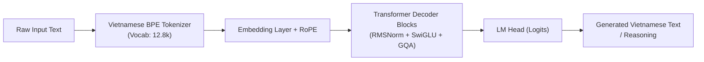
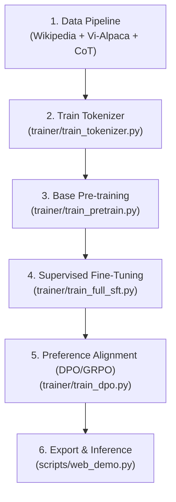

# 🇻🇳 ViMind: Small, Efficient & Native Vietnamese Language Model from Scratch

[](https://www.python.org/)
[](https://pytorch.org/)
[](LICENSE)
[-brightgreen.svg)]()
[]()
[]()

> **ViMind** is an open-source, ultra-lightweight Small Language Model (SLM) engineered **100% from scratch specifically for the Vietnamese language**.
>
> Built with zero enterprise budget ($0), ViMind provides a transparent, production-ready, end-to-end framework: from custom **Vietnamese Byte-level BPE Tokenization**, **Pre-training**, **Supervised Fine-Tuning (SFT)** with Chain-of-Thought (`<think>`) reasoning, to **Direct Preference Optimization (DPO / GRPO)** and **Tool Calling**.

---

## 📑 Table of Contents
1. [Key Features](#-key-features)
2. [Model Architecture & Specifications](#-model-architecture--specifications)
3. [The Zero-Dollar ($0) Strategy](#-the-zero-dollar-0-strategy)
4. [Repository Structure](#-repository-structure)
5. [Data Engineering & Synthesis Pipeline](#-data-engineering--synthesis-pipeline)
6. [End-to-End Training Lifecycle](#-end-to-end-training-lifecycle)
   - [Phase 1: Native Vietnamese Tokenizer](#phase-1-native-vietnamese-tokenizer)
   - [Phase 2: Base Pre-training](#phase-2-base-pre-training)
   - [Phase 3: Supervised Fine-Tuning (SFT) & CoT Reasoning](#phase-3-supervised-fine-tuning-sft--cot-reasoning)
   - [Phase 4: Alignment & RL (DPO / GRPO)](#phase-4-alignment--rl-dpo--grpo)
   - [Phase 5: Model Export & Deployment](#phase-5-model-export--deployment)
7. [Quickstart & Installation](#-quickstart--installation)
8. [Benchmarks & Evaluation](#-benchmarks--evaluation)
9. [Development Roadmap](#-development-roadmap)
10. [License & Acknowledgments](#-license--acknowledgments)

---

## 🌟 Key Features

- 🇻🇳 **Native Vietnamese Tokenization**: Custom Byte-level BPE vocabulary optimized for Vietnamese tone marks, syllabic boundaries, and Unicode NFC normalization — avoiding fragmentations and high token penalties caused by standard English/multilingual tokenizers.
- ⚡ **Ultra-Lightweight & Agile**: Available in **26M, 64M, and 104M parameter** variants. Operates smoothly on edge devices, consumer laptops, mobile devices, and CPU-only environments (via ONNX / GGUF).
- 🧬 **Modern SOTA Architectural Primitives**:
  - **RMSNorm** (Root Mean Square Layer Normalization) for high numerical stability.
  - **RoPE** (Rotary Position Embeddings) for dynamic context scaling.
  - **SwiGLU** activation function for rich non-linear representations.
  - **Grouped-Query Attention (GQA)** for low KV-cache memory consumption during inference.
- 🧠 **Deep Reasoning with `<think>` Tags**: Incorporates Chain-of-Thought (CoT) step-by-step thinking tokens inspired by DeepSeek-R1.
- 🛠️ **Native Tool-Calling & ReAct Agent Support**: Pre-configured for function calling, structured JSON output, and multi-turn interactive dialogues.
- 🔍 **Zero Black-Box Abstractions**: Written in clean, readable, modular PyTorch without heavy wrapper bloat.

---

## 🏗️ Model Architecture & Specifications



### Parameter Configurations

| Specification | **ViMind-Mini** (26M) | **ViMind-Base** (64M) ⭐ *Recommended* | **ViMind-Plus** (104M) |
| :--- | :--- | :--- | :--- |
| **Hidden Dimension ($d_{model}$)** | 512 | 768 | 768 |
| **Transformer Layers** | 8 | 16 | 24 |
| **Attention Heads ($n_{heads}$)** | 8 | 12 | 12 |
| **Key-Value Heads ($n_{kv}$ - GQA)** | 2 | 4 | 4 |
| **Intermediate Size (FFN)** | 1,408 | 2,048 | 2,048 |
| **Vocabulary Size** | 6,400 | 12,800 | 16,000 |
| **Max Sequence Length** | 512 | 1,024 | 2,048 |
| **Training VRAM Requirement** | ~3.0 GB | ~6.0 GB | ~10.5 GB |
| **Training Time (1x T4 GPU)** | ~1.5 Hours | ~3.5 Hours | ~8.0 Hours |

---

## 💰 The Zero-Dollar ($0) Strategy

You don't need a multi-million-dollar compute cluster to build a high-performance Small Language Model. ViMind is purposefully designed to run entirely on **free-tier ecosystem resources**:

| Component | Free Platform / Tool | Operational Detail | Cost |
| :--- | :--- | :--- | :--- |
| **Compute / Training** | **Kaggle Notebooks** | 30 GPU hours/week with **2x NVIDIA Tesla T4 (16GB)**. | **$0.00** |
| **Pre-training Corpus** | **Wikipedia VN + Clean News** | Extracted via Hugging Face `datasets` & automated clean crawlers. | **$0.00** |
| **SFT Instruction Data** | **Vi-Alpaca / OpenHermes-VI** | Permissive open-source Vietnamese instruction corpora. | **$0.00** |
| **Synthetic CoT Generation**| **Google AI Studio (Gemini Flash)**| Free tier (1,500 daily requests) to synthesize `<think>` reasoning traces. | **$0.00** |
| **Weights & Data Hosting** | **Hugging Face Hub** | Unlimited storage for datasets, tokenizer configs, and `.safetensors`. | **$0.00** |
| **Interactive Web Demo** | **Hugging Face Spaces** | Free 24/7 web application hosting using Streamlit. | **$0.00** |

---

## 📂 Repository Structure

```
vimind/
├── data_pipeline/                # Data scraping, filtering & synthesis scripts
│   ├── download_viwiki.py        # Extract clean text from Vietnamese Wikipedia
│   ├── crawl_vietnews.py         # Curated web crawler for educational/news articles
│   ├── clean_and_normalize.py    # NFC Unicode normalizer, regex & MinHash deduplication
│   └── generate_synthetic_cot.py # Free-tier LLM API pipeline for <think> CoT data synthesis
│
├── dataset/                      # Preprocessed JSONL training datasets
│   ├── pretrain_vi.jsonl         # Clean raw corpus for unsupervised pre-training
│   ├── sft_vi.jsonl              # Multi-turn instruction & reasoning dataset
│   └── dpo_vi.jsonl              # Preference pairs (chosen / rejected) for DPO
│
├── model/                        # Neural network architectures & tokenizer configurations
│   ├── __init__.py
│   ├── model_vimind.py           # Core Transformer Decoder (RMSNorm, RoPE, SwiGLU, GQA)
│   ├── model_lora.py             # Native Low-Rank Adaptation (LoRA) implementation
│   ├── tokenizer.json            # Trained Byte-level BPE tokenizer file
│   └── tokenizer_config.json     # Standard Hugging Face tokenizer configuration
│
├── trainer/                      # Training execution scripts for all phases
│   ├── train_tokenizer.py        # Custom Byte-level BPE Tokenizer trainer
│   ├── train_pretrain.py         # Phase 1: Next-Token-Prediction pre-training
│   ├── train_full_sft.py         # Phase 2: Full-parameter Supervised Fine-Tuning
│   ├── train_lora.py             # Phase 2 (Alternative): Parameter-Efficient LoRA SFT
│   ├── train_dpo.py              # Phase 3: Direct Preference Optimization
│   ├── train_grpo.py             # Phase 3 (Alternative): Group Relative Policy Optimization
│   └── trainer_utils.py          # LR schedulers, gradient clipping, logger utilities
│
├── scripts/                      # Deployment, export, and interface utilities
│   ├── convert_to_huggingface.py # Export PyTorch checkpoint to Hugging Face format
│   ├── web_demo.py               # Interactive Streamlit Web Chat UI
│   ├── serve_openai_api.py       # FastAPI server matching OpenAI `/v1/chat/completions`
│   └── eval_benchmarks.py        # Perplexity, reasoning, and grammar benchmark suite
│
├── requirements.txt              # Project dependencies
├── LICENSE                       # Apache 2.0 License
└── README.md                     # Project documentation (this file)
```

---

## 📊 Data Engineering & Synthesis Pipeline

Following the modern *"Textbooks Are All You Need"* paradigm, ViMind prioritizes data density and semantic cleanliness over raw web volume.

### 1. Pre-training Corpus (`dataset/pretrain_vi.jsonl`)
* **Target Size**: ~500 MB – 1.5 GB of curated text (~150M – 400M tokens).
* **Format**:
  ```json
  {"text": "Hồ Gươm (hay Hồ Hoàn Kiếm) là một danh lam thắng cảnh tự nhiên nổi tiếng tọa lạc tại trung tâm thủ đô Hà Nội, Việt Nam."}
  {"text": "Kiến trúc Transformer sử dụng cơ chế Multi-Head Attention để mô hình hóa mối tương quan ngữ nghĩa giữa các token trong câu."}
  ```

### 2. SFT & Reasoning Corpus (`dataset/sft_vi.jsonl`)
* **Format**: Multi-turn dialogue with integrated Chain-of-Thought `<think>` tags:
  ```json
  {
    "conversations": [
      {
        "role": "user",
        "content": "Tại sao bầu trời vào ban ngày lại có màu xanh lam?"
      },
      {
        "role": "assistant",
        "content": "<think>\nNgười dùng hỏi về nguyên lý vật lý khiến bầu trời có màu xanh. Cần giải thích hiện tượng tán xạ Rayleigh: ánh sáng mặt trời chứa nhiều bước sóng, ánh sáng xanh có bước sóng ngắn hơn nên bị các phân tử khí quyển tán xạ mạnh nhất về mọi hướng đến mắt người quan sát.\n</think>\nBầu trời có màu xanh lam vào ban ngày là do hiện tượng **tán xạ Rayleigh**. Ánh sáng từ Mặt Trời là ánh sáng trắng bao gồm nhiều màu sắc với bước sóng khác nhau. Do ánh sáng màu xanh lam có bước sóng ngắn, nó bị các phân tử khí và hạt bụi nhỏ trong khí quyển Trái Đất tán xạ mạnh hơn nhiều so với các ánh sáng có bước sóng dài (như đỏ, vàng), tạo nên sắc xanh đặc trưng khi quan sát từ mặt đất."
      }
    ]
  }
  ```

### 3. DPO Alignment Corpus (`dataset/dpo_vi.jsonl`)
* **Format**:
  ```json
  {
    "chosen": [
      {"role": "user", "content": "Thủ đô của Việt Nam là gì?"},
      {"role": "assistant", "content": "Thủ đô của Việt Nam là Hà Nội."}
    ],
    "rejected": [
      {"role": "user", "content": "Thủ đô của Việt Nam là gì?"},
      {"role": "assistant", "content": "Thủ đô của Việt Nam là Thành phố Hồ Chí Minh."}
    ]
  }
  ```

---

## 🚀 End-to-End Training Lifecycle



### Phase 1: Native Vietnamese Tokenizer
Train a custom Byte-level Byte Pair Encoding (BPE) tokenizer tailored to Vietnamese syllables:
```bash
python trainer/train_tokenizer.py \
    --data_path dataset/pretrain_vi.jsonl \
    --vocab_size 12800 \
    --output_dir model/
```

### Phase 2: Base Pre-training
Pre-train the foundation transformer on Next-Token-Prediction:
```bash
python trainer/train_pretrain.py \
    --data_path dataset/pretrain_vi.jsonl \
    --dim 768 \
    --n_layers 16 \
    --n_heads 12 \
    --max_seq_len 1024 \
    --batch_size 32 \
    --learning_rate 5e-4 \
    --epochs 3 \
    --output_dir out/
```

### Phase 3: Supervised Fine-Tuning (SFT) & CoT Reasoning
Train the model to follow instructions and generate reasoning traces:
```bash
python trainer/train_full_sft.py \
    --data_path dataset/sft_vi.jsonl \
    --pretrain_checkpoint out/pretrain_768.pth \
    --max_seq_len 1024 \
    --batch_size 16 \
    --learning_rate 1e-4 \
    --epochs 3 \
    --output_dir out/
```

### Phase 4: Alignment & RL (DPO / GRPO)
Align the model responses against human preferences using DPO:
```bash
python trainer/train_dpo.py \
    --data_path dataset/dpo_vi.jsonl \
    --sft_checkpoint out/sft_768.pth \
    --learning_rate 1e-5 \
    --epochs 2 \
    --output_dir out/
```

### Phase 5: Model Export & Deployment
Convert raw PyTorch weights into standard Hugging Face `safetensors` format:
```bash
python scripts/convert_to_huggingface.py \
    --input_checkpoint out/sft_768.pth \
    --output_dir exported_model/
```

Launch the interactive web chat application:
```bash
streamlit run scripts/web_demo.py
```

Or deploy an OpenAI-compatible REST server:
```bash
python scripts/serve_openai_api.py --port 8000
```

---

## 🛠️ Quickstart & Installation

```bash
# 1. Clone the repository
git clone https://github.com/your-username/vimind.git
cd vimind

# 2. Set up a virtual environment
python -m venv venv
# On Windows:
.\venv\Scripts\activate
# On Linux/macOS:
source venv/bin/activate

# 3. Install core dependencies
pip install -r requirements.txt
```

---

## 🗺️ Development Roadmap

- [x] Project architecture design & specification.
- [ ] Automated data extraction pipeline (Wikipedia VN + curated news).
- [ ] High-efficiency Vietnamese Byte-level BPE tokenizer.
- [ ] Pre-training baseline **ViMind-Base (64M)** on Kaggle T4.
- [ ] SFT integration with synthetic reasoning (`<think>`) traces.
- [ ] DPO / GRPO alignment pipeline.
- [ ] GGUF 4-bit quantization for on-device deployment (llama.cpp / Ollama).
- [ ] Public release on Hugging Face Model Hub & Spaces demo.

---

## 📜 License & Acknowledgments

- Released under the **[Apache License 2.0](LICENSE)**.
- Architectural inspiration and training loops derived from the pioneering work of `minimind` by Jingyao Gong and the broader open-source AI community.
