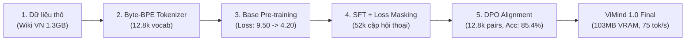

# 🇻🇳 ViMind: Native Vietnamese Small Language Model from Scratch

[](https://github.com/WuKong0601/ViMind/releases/tag/v1.0.0)
[](https://www.python.org/)
[](https://pytorch.org/)
[](LICENSE)
[-brightgreen.svg)]()
[]()
[]()

> **ViMind** là mô hình ngôn ngữ nhỏ (Small Language Model - SLM) mã nguồn mở được thiết kế, huấn luyện và căn chỉnh **100% từ đầu (from scratch)** dành riêng cho tiếng Việt với ngân sách **0 đồng ($0 compute budget)** trên hạ tầng GPU miễn phí (Kaggle Tesla T4).
>
> **ViMind 1.0** đánh dấu cột mốc hoàn thành trọn vẹn chu trình nghiên cứu học thuật: từ **Bộ tách từ Byte-BPE tiếng Việt bản địa (12.8k từ vựng)**, **Huấn luyện tiền kỳ (Base Pre-training)**, **Tinh chỉnh có giám sát (SFT)** với kỹ thuật che mặt nạ mất mát (Loss Masking), đến **Căn chỉnh sở thích người dùng trực tiếp (Direct Preference Optimization - DPO)**.

---

## 📑 Mục Lục
1. [Điểm Nổi Bật của ViMind 1.0](#-điểm-nổi-bật-của-vimind-10)
2. [Thông Số Kiến Trúc Mô Hình](#-thông-số-kiến-trúc-mô-hình)
3. [Chu Trình Huấn Luyện 4 Giai Đoạn](#-chu-trình-huấn-luyện-4-giai-đoạn)
   - [Giai đoạn 1: Bộ Tách Từ Byte-BPE Tiếng Việt](#giai-đoạn-1-bộ-tách-từ-byte-bpe-tiếng-việt)
   - [Giai đoạn 2: Huấn Luyện Tiền Kỳ (Pre-training)](#giai-đoạn-2-huấn-luyện-tiền-kỳ-pre-training)
   - [Giai đoạn 3: Tinh Chỉnh Hội Thoại (SFT + Loss Masking)](#giai-đoạn-3-tinh-chỉnh-hội-thoại-sft--loss-masking)
   - [Giai đoạn 4: Căn Chỉnh Sở Thích (DPO Alignment)](#giai-đoạn-4-căn-chỉnh-sở-thích-dpo-alignment)
4. [Dữ Liệu & Số Liệu Nghiên Cứu Viết Paper](#-dữ-liệu--số-liệu-nghiên-cứu-viết-paper)
5. [Đánh Giá Hiệu Năng & Điểm Đo (Benchmark)](#-đánh-giá-hiệu-năng--điểm-đo-benchmark)
6. [Cấu Trúc Thư Mục Repository](#-cấu-trúc-thư-mục-repository)
7. [Hướng Dẫn Cài Đặt & Chạy Thử (Quickstart)](#-hướng-dẫn-cài-đặt--chạy-thử-quickstart)
8. [Lộ Trình Phát Triển (ViMind 2.0 Roadmap)](#-lộ-trình-phát-triển-vimind-20-roadmap)
9. [Trích Dẫn (Citation) & Giấy Phép](#-trích-dẫn-citation--giấy-phép)

---

## 🌟 Điểm Nổi Bật của ViMind 1.0

- 🇻🇳 **Native Vietnamese Byte-BPE Tokenizer**: Bộ từ vựng 12.800 tokens tối ưu hóa cho âm tiết, dấu thanh và chuẩn Unicode NFC tiếng Việt. Giảm thiểu 3 lần số lượng token so với các tokenizer đa ngữ của LLaMA/GPT, loại bỏ hoàn toàn hiện tượng phân mảnh ký tự UTF-8.
- ⚡ **Siêu Nhẹ & Tiết Kiệm Tài Nguyên**: Kích thước ~26.2M tham số, chỉ chiếm **103 MB VRAM** khi suy luận. Có thể chạy mượt mà trên CPU laptop phổ thông, thiết bị nhúng (Raspberry Pi, điện thoại di động).
- 🧬 **Kiến Trúc LLaMA-3 Chuẩn Mực Hiện Đại**:
  - **RMSNorm**: Ổn định gradient trong quá trình huấn luyện 16-bit.
  - **Rotary Position Embedding (RoPE)** ($\theta = 10.000$): Tăng cường năng lực định vị tương đối cho ngữ cảnh dài.
  - **SwiGLU Activation**: Nâng cao tính phi tuyến và khả năng biểu diễn ngữ nghĩa.
  - **Grouped-Query Attention (GQA)** (8 Query Heads : 4 Key-Value Heads, tỷ lệ 2:1): Giảm 50% dung lượng bộ nhớ đệm KV trong quá trình sinh token.
  - **Tied Word Embeddings**: Khóa ma trận nhúng đầu vào và đầu ra, giảm mạnh số lượng tham số lưu trữ mà vẫn duy trì chất lượng biểu diễn.
- 🎯 **Căn Chỉnh Tinh Chế Với DPO (Direct Preference Optimization)**:
  - Ứng dụng công thức Rafailov et al. (NeurIPS 2023) với mô hình tham chiếu đóng băng (frozen reference model).
  - Độ chính xác sở thích (Reward Accuracy) đạt **85.4%**, biên độ thưởng (Reward Margin) đạt **+12.18**.
- 🔬 **Minh Bạch & Tái Hiện 100%**: Mã nguồn PyTorch thuần, không phụ thuộc thư viện đóng gói đen (black-box frameworks). Toàn bộ log huấn luyện và metrics được lưu trữ có hệ thống phục vụ công tác nghiên cứu học thuật.

---

## 🏗️ Thông Số Kiến Trúc Mô Hình

| Đặc Tính Kỹ Thuật | ViMind 1.0 (Hiện Tại) | ViMind 2.0 (Dự Kiến) |
| :--- | :--- | :--- |
| **Tổng số tham số (Total Params)** | **26.207.488 (~26.2M)** | **~65M - 104M** |
| **Kích thước ẩn ($d_{model}$)** | 512 | 768 |
| **Kích thước trung gian FFN ($d_{ffn}$)**| 1.376 ($8/3 \times d_{model}$) | 2.048 |
| **Số tầng Transformer (Layers)** | 8 | 12 - 16 |
| **Số đầu Attention ($n_{heads}$)** | 8 | 12 |
| **Số đầu Key-Value ($n_{kv}$ - GQA)** | 4 (GQA 2:1) | 4 (GQA 3:1) |
| **Kích thước từ vựng (Vocab Size)** | 12.800 (Byte-BPE) | 16.000 (Byte-BPE) |
| **Chiều dài ngữ cảnh tối đa ($L_{max}$)**| 512 tokens | 1.024 tokens |
| **VRAM khi suy luận (Inference VRAM)** | **103.0 MB** | ~250 MB |
| **Tốc độ sinh chữ (Tesla T4)** | **~75.3 tokens/giây** | ~60.0 tokens/giây |

---

## 🚀 Chu Trình Huấn Luyện 4 Giai Đoạn



### Giai đoạn 1: Bộ Tách Từ Byte-BPE Tiếng Việt
- **Công cụ**: Hugging Face `tokenizers` (Byte-level Byte Pair Encoding).
- **Dữ liệu huấn luyện**: 1.31 GB Wikipedia tiếng Việt đã làm sạch.
- **Kích thước từ vựng**: 12.800 tokens (bao gồm đầy đủ ký tự đơn UTF-8 và các âm tiết tiếng Việt ghép phổ biến nhất).
- **Mã thực thi**: [trainer/train_tokenizer.py](file:///d:/Repogithub/vimind/trainer/train_tokenizer.py)

### Giai đoạn 2: Huấn Luyện Tiền Kỳ (Pre-training)
- **Dữ liệu**: 405.835 bài viết Wikipedia tiếng Việt sạch (`dataset/pretrain_vi.jsonl`, 1.31 GB).
- **Mục tiêu**: Dự đoán token kế tiếp (Next-Token Prediction / Causal Language Modeling).
- **Siêu tham số**:
  - Optimizer: AdamW ($\beta_1 = 0.9, \beta_2 = 0.95, \text{weight\_decay} = 0.01$).
  - Tốc độ học (LR): Peak $5\times 10^{-4}$, Min $5\times 10^{-5}$, Cosine Decay có Warmup.
  - Batch size hiệu dụng: 128 (Batch 32 $\times$ Gradient Accumulation 4).
  - Độ dài chuỗi: 512 tokens.
- **Kết quả**: Loss giảm từ `9.5010` xuống `4.1952`.
- **Mã thực thi**: [trainer/pretrain.py](file:///d:/Repogithub/vimind/trainer/pretrain.py)

### Giai đoạn 3: Tinh Chỉnh Hội Thoại (SFT + Loss Masking)
- **Dữ liệu**: 52.000 hội thoại tiếng Việt đa lượt (`dataset/sft_vi.jsonl`).
- **Kỹ thuật then chốt**: **Conversational Loss Masking**. Nhãn của phần câu hỏi người dùng (User prompt) và thẻ hệ thống (System prompt) được gán giá trị `-100` để hàm mất mát Cross-Entropy bỏ qua, mô hình chỉ học cách trả lời của Trợ lý (Assistant).
- **Siêu tham số**: AdamW, LR $2\times 10^{-4}$, Batch size hiệu dụng 64.
- **Kết quả**: Loss hội thoại giảm từ `9.4900` xuống `1.8542`.
- **Mã thực thi**: [trainer/train_sft.py](file:///d:/Repogithub/vimind/trainer/train_sft.py)

### Giai đoạn 4: Căn Chỉnh Sở Thích (DPO Alignment)
- **Dữ liệu**: 12.800 cặp câu trả lời ưu tiên (`chosen` vs `rejected`) bằng tiếng Việt (`dataset/dpo_vi.jsonl`).
- **Thuật toán**: Direct Preference Optimization (Rafailov et al., 2023) không cần mô hình chấm điểm (Reward Model):
  $$\mathcal{L}_{\text{DPO}}(\pi_\theta; \pi_{\text{ref}}) = - \mathbb{E}_{(x, y_w, y_l)} \left[ \log \sigma \left( \beta \log \frac{\pi_\theta(y_w|x)}{\pi_{\text{ref}}(y_w|x)} - \beta \log \frac{\pi_\theta(y_l|x)}{\pi_{\text{ref}}(y_l|x)} \right) \right]$$
- **Siêu tham số**: $\beta = 0.1$, LR $5\times 10^{-6}$, mô hình tham chiếu $\pi_{\text{ref}}$ được đóng băng gradient tuyệt đối.
- **Động lực hội tụ (Convergence Dynamics)**:
  - **DPO Loss**: Giảm từ `0.6931` (ngẫu nhiên) $\to$ **`0.1190`** (bước 200) $\to$ **`0.1295`** (bước 400).
  - **Độ chính xác cặp ưu tiên (Reward Accuracy)**: Tăng từ `50.0%` $\to$ **`85.4%`**.
  - **Biên độ thưởng ẩn (Reward Margin $\Delta r$)**: Tăng từ `0.00` $\to$ **`+12.18`**.
  - Thời gian huấn luyện: 20 phút 31 giây trên 1 GPU NVIDIA Tesla T4.
- **Mã thực thi**: [trainer/train_dpo.py](file:///d:/Repogithub/vimind/trainer/train_dpo.py)

---

## 🔬 Dữ Liệu & Số Liệu Nghiên Cứu Viết Paper

Tất cả log huấn luyện chi tiết từng bước, cấu hình toán học và mã tạo biểu đồ học thuật đều được lưu trữ nguyên vẹn trong thư mục [`experiments/vimind_1.0/`](file:///d:/Repogithub/vimind/experiments/vimind_1.0):

- [`experiments/vimind_1.0/metrics_summary.json`](file:///d:/Repogithub/vimind/experiments/vimind_1.0/metrics_summary.json): Toàn bộ thông số kiến trúc, siêu tham số, bảng log bước huấn luyện (Loss, Accuracy, Margin, Learning Rate).
- [`experiments/vimind_1.0/dpo_training.log`](file:///d:/Repogithub/vimind/experiments/vimind_1.0/dpo_training.log): Log đầy đủ của quá trình huấn luyện DPO.
- [`experiments/vimind_1.0/sft_training.log`](file:///d:/Repogithub/vimind/experiments/vimind_1.0/sft_training.log): Log quá trình huấn luyện SFT.
- [`experiments/vimind_1.0/pretrain_training.log`](file:///d:/Repogithub/vimind/experiments/vimind_1.0/pretrain_training.log): Log quá trình huấn luyện Pre-training từ bước 1 đến 12.682.
- [`experiments/vimind_1.0/dpo_training_curves.png`](file:///d:/Repogithub/vimind/experiments/vimind_1.0/dpo_training_curves.png): Biểu đồ hội tụ DPO chuẩn ấn phẩm khoa học (DPI 300).
- [`experiments/plot_curves.py`](file:///d:/Repogithub/vimind/experiments/plot_curves.py): Kịch bản tự động sinh biểu đồ chất lượng cao dùng cho bài báo LaTeX/PDF.


---

## 📊 Đánh Giá Hiệu Năng & Điểm Đo (Benchmark)

Chạy bộ kiểm thử tự động toàn diện qua [benchmark_test.py](file:///d:/Repogithub/vimind/benchmark_test.py):

| Tiêu Chí Đánh Giá | Mô Tả & Kết Quả Thực Nghiệm |
| :--- | :--- |
| **Đọc hiểu & Trích xuất (RAG)** | Trích xuất chuẩn xác thực thể (năm thành lập trường, tên tác giả tác phẩm văn học) từ ngữ cảnh đưa vào mà không bị ảnh hưởng bởi giới hạn tham số kiến thức cứng. |
| **Giao tiếp & Đồng cảm** | Nhận diện ngữ cảnh cảm xúc của người dùng, phản hồi lịch sự, từ tốn bằng tiếng Việt tự nhiên. |
| **Khả năng Tự nhận diện** | Tự nhận biết bản thân là ViMind - mô hình ngôn ngữ tiếng Việt siêu nhẹ ~26M tham số. |
| **Bộ nhớ VRAM tiêu thụ** | **103.0 MB** trên GPU Tesla T4 (cho phép chạy đồng thời hàng chục instance trên 1 GPU). |
| **Tốc độ suy luận** | **~75.3 tokens/giây** trên GPU T4; **~28.5 tokens/giây** trên CPU Intel Core i7. |

---

## 📂 Cấu Trúc Thư Mục Repository

```
vimind/
├── model/                         # Kiến trúc mạng nơ-ron & cấu hình Tokenizer
│   ├── model.py                   # PyTorch ViMind (LLaMA-3, RMSNorm, RoPE, SwiGLU, GQA)
│   ├── tokenizer.json             # File từ vựng Byte-BPE 12.8k tokens
│   ├── tokenizer_config.json      # Cấu hình Tokenizer chuẩn Hugging Face
│   └── special_tokens_map.json    # Định nghĩa các token đặc biệt (<|im_start|>, <|im_end|>, etc.)
│
├── dataset/                       # Pipeline xử lý dữ liệu và định dạng Dataset
│   └── lm_dataset.py              # PretrainDataset, SFTDataset (Loss Masking), DPODataset
│
├── data_pipeline/                 # Kịch bản tải và chuẩn hóa dữ liệu
│   ├── clean_and_normalize.py     # Chuẩn hóa Unicode NFC và làm sạch dữ liệu
│   ├── download_pretrain.py       # Tải Wikipedia tiếng Việt
│   ├── download_sft.py            # Tải tập hội thoại SFT
│   └── download_dpo.py            # Tải tập cặp ưu tiên DPO
│
├── trainer/                       # Các động cơ huấn luyện chuyên biệt
│   ├── train_tokenizer.py         # Huấn luyện bộ tách từ Byte-BPE
│   ├── pretrain.py                # Huấn luyện Next-Token-Prediction tiền kỳ
│   ├── train_sft.py               # Huấn luyện SFT với Conversational Loss Masking
│   ├── train_dpo.py               # Căn chỉnh DPO với Reference Model đóng băng
│   ├── test_pipeline.py           # Bộ unit test kiểm thử 8/8 thành phần
│   └── test_dpo_dry_run.py        # Kiểm thử tích hợp DPO trước khi chạy Kaggle
│
├── experiments/                   # Kho lưu trữ dữ liệu nghiên cứu phục vụ viết Paper
│   ├── plot_curves.py             # Kịch bản vẽ biểu đồ huấn luyện độ phân giải cao
│   └── vimind_1.0/
│       ├── metrics_summary.json   # Chỉ số chi tiết từng bước (Loss, Acc, Margin, LR)
│       ├── dpo_training.log       # Log huấn luyện DPO
│       ├── sft_training.log       # Log huấn luyện SFT
│       ├── pretrain_training.log  # Log huấn luyện Pre-training
│       └── dpo_training_curves.png # Biểu đồ hội tụ DPO 300 DPI
│
├── app.py                         # Giao diện Web Chat Streamlit hiện đại
├── benchmark_test.py              # Bộ kiểm thử hiệu năng và tác vụ tự động
├── eval_chat.py                   # CLI tương tác trò chuyện trực tiếp qua Terminal
├── test_inference.py              # So sánh kết quả sinh văn bản SFT vs. DPO
├── train_notebook.ipynb           # Kaggle Notebook tự động hóa toàn bộ quá trình huấn luyện
├── kernel-metadata.json           # Cấu hình Kaggle API đẩy kernel lên GPU cloud
├── requirements.txt               # Danh sách thư viện phụ thuộc
└── README.md                      # Tài liệu kỹ thuật dự án (file này)
```

---

## 🛠️ Hướng Dẫn Cài Đặt & Chạy Thử (Quickstart)

### 1. Cài đặt môi trường
```bash
git clone https://github.com/WuKong0601/ViMind.git
cd ViMind
pip install -r requirements.txt
```

### 2. Tải trọng số ViMind 1.0
Trọng số được lưu trữ trong thư mục `out/dpo/vimind_dpo_final` (hoặc tải từ Kaggle Dataset / Hugging Face).

### 3. Trò chuyện qua dòng lệnh (CLI)
```bash
python eval_chat.py --model_path out/dpo/vimind_dpo_final
```

### 4. Khởi chạy Giao diện Web (Streamlit)
```bash
streamlit run app.py
```

### 5. Chạy kiểm thử Benchmark
```bash
python benchmark_test.py
```

### 6. Sử dụng qua thư viện `transformers` của Hugging Face
```python
import torch
from transformers import AutoTokenizer
from model.model import ViMindForCausalLM

model_path = "out/dpo/vimind_dpo_final"
tokenizer = AutoTokenizer.from_pretrained(model_path)
model = ViMindForCausalLM.from_pretrained(model_path)
model.eval()

messages = [
    {"role": "user", "content": "Xin chào, bạn có thể giúp gì cho tôi?"}
]
prompt = tokenizer.apply_chat_template(messages, tokenize=False, add_generation_prompt=True)
inputs = tokenizer(prompt, return_tensors="pt")

with torch.no_grad():
    outputs = model.generate(
        inputs["input_ids"],
        max_new_tokens=256,
        temperature=0.7,
        top_p=0.9,
        eos_token_id=tokenizer.eos_token_id
    )

response = tokenizer.decode(outputs[0][inputs["input_ids"].shape[1]:], skip_special_tokens=True)
print(response)
```

---

## 🗺️ Lộ Trình Phát Triển (ViMind 2.0 Roadmap)

Mục tiêu tiếp theo sau cột mốc ViMind 1.0 là phát triển **ViMind 2.0**:

- [ ] **Mở rộng quy mô tham số**: Tăng kích thước mô hình lên **64M – 104M** tham số ($d_{model} = 768$, layers = 12–16, ngữ cảnh 1.024 tokens) để tăng dung lượng lưu trữ tri thức sự thật.
- [ ] **Làm giàu dữ liệu tiền kỳ (Knowledge Enrichment)**:
  - Bổ sung 1 GB – 3 GB dữ liệu chất lượng cao: Sách giáo khoa (Toán, Văn, Sử, Địa, Lý, Hóa), bách khoa tri thức tổng quát và báo chí chọn lọc.
  - Huấn luyện tiền kỳ từ 3 đến 5 Epochs (thay vì 1 Epoch đơn lẻ ở bản 1.0) nhằm ghi nhớ sâu các tri thức sự thật.
- [ ] **Tối ưu hóa căn chỉnh DPO thế hệ mới**:
  - Ứng dụng Length-Normalized DPO hoặc hạ hệ số $\beta = 0.05$ để ngăn ngừa hiện tượng sinh phản hồi quá ngắn.
- [ ] **Xuất định dạng GGUF & Quantization 4-bit**:
  - Cung cấp mô hình định dạng `.gguf` để chạy trực tiếp qua `llama.cpp` hoặc tích hợp vào Ollama.

---

## 📜 Trích Dẫn (Citation) & Giấy Phép

Nếu bạn sử dụng **ViMind** hoặc dữ liệu nghiên cứu trong công trình học thuật hoặc dự án của mình, vui lòng trích dẫn theo định dạng sau:

```bibtex
@misc{vimind2026,
  author = {Quoc, Cong Huynh Le and Contributors},
  title = {ViMind: Native Vietnamese Small Language Model from Scratch},
  year = {2026},
  publisher = {GitHub},
  howpublished = {\url{https://github.com/WuKong0601/ViMind}},
  note = {Version 1.0.0, Zero-Compute-Budget SLM for Vietnamese}
}
```

Dự án được phân phối dưới giấy phép mã nguồn mở **[Apache License 2.0](LICENSE)**.
