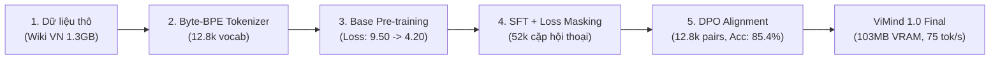
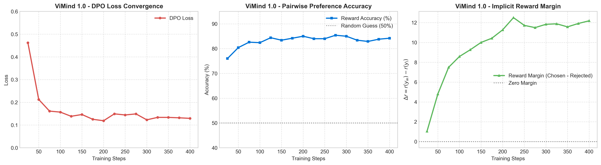

# 🇻🇳 ViMind: Native Vietnamese Small Language Model from Scratch

[](https://github.com/WuKong0601/ViMind/releases/tag/v3.0.0)
[](https://www.python.org/)
[](https://pytorch.org/)
[](LICENSE)
[]()
[]()
[]()

> **ViMind** là mô hình ngôn ngữ nhỏ (Small Language Model - SLM) mã nguồn mở được thiết kế, huấn luyện và căn chỉnh **100% từ đầu (from scratch)** dành riêng cho tiếng Việt với ngân sách **0 đồng ($0 compute budget)** trên hạ tầng GPU miễn phí (Kaggle Tesla T4).
>
> **ViMind 3.0** là bước nhảy vọt kiến trúc toàn diện:
> 1. **Kiến trúc MoE (Mixture-of-Experts):** 198M tham số với 4 chuyên gia (Experts), kích hoạt 1 chuyên gia (64M active) mỗi token với Top-1 Gating & cân bằng tải Router Auxiliary Loss.
> 2. **Mở rộng ngữ cảnh YaRN RoPE:** Hỗ trợ suy luận văn bản dài lên tới **32.768 tokens** (`rope_theta = 1e6`).
> 3. **Giám khảo Offline Qwen2.5-7B-Instruct (4-bit NF4):** Đánh giá gán nhãn cặp câu trả lời RLAIF trực tiếp trên GPU không tốn phí và không bị giới hạn API rate limit.
> 4. **Agentic Reinforcement Learning (GRPO):** Huấn luyện mô hình tự suy luận (`<think>`) và gọi công cụ chuyên dụng (`<tool_call>`) với môi trường thực thi giả lập.
> 5. **Hệ sinh thái Triển khai Toàn diện:** Máy chủ FastAPI tương thích 100% chuẩn OpenAI API (`/v1/chat/completions`), SSE Streaming, giao diện WebUI Streamlit hiện đại.

---

## 🏗️ Thông Số Kiến Trúc Mô Hình Qua Các Thế Hệ

| Đặc Tính Kỹ Thuật | ViMind 1.0 (Base) | ViMind 2.0 (Dense) | ViMind 3.0 (MoE Mới Nhất) |
| :--- | :--- | :--- | :--- |
| **Kiến Trúc** | Dense CausalLM | Dense CausalLM + LoRA | **Mixture-of-Experts (MoE)** |
| **Tổng số tham số** | **26.2M** | **62.8M** | **198.3M** |
| **Tham số kích hoạt / token** | 26.2M | 62.8M | **64.1M (Top-1 Expert)** |
| **Số chuyên gia (Experts)** | 1 (Dense) | 1 (Dense) | **4 Experts (Top-1 Routing)** |
| **Kích thước ẩn ($d_{model}$)** | 512 | 640 | 640 |
| **Kích thước FFN ($d_{ffn}$)**| 1.376 | 1.792 | 1.792 per Expert |
| **Số tầng Transformer** | 8 | 12 | 12 (MoE Feed-Forward) |
| **Số đầu Attention ($n_{heads}$)** | 8 | 10 | 10 (GQA 10:5) |
| **Ngữ cảnh tối đa ($L_{max}$)**| 512 tokens | 1.024 tokens | **32.768 tokens (YaRN RoPE)** |
| **Tokens đặc biệt** | Chuẩn ChatML | Chuẩn ChatML | `<think>`, `</think>`, `<tool_call>`, `</tool_call>` |
| **VRAM khi suy luận** | **103 MB** | **~245 MB** | **~260 MB (MoE Top-1)** |
| **Tốc độ sinh chữ (T4)** | ~75 tok/s | ~62 tok/s | **~58 tok/s** |

---

## 🚀 Chu Trình Huấn Luyện 4 Giai Đoạn



### Giai đoạn 1: Bộ Tách Từ Byte-BPE Tiếng Việt
- **Công cụ**: Hugging Face `tokenizers` (Byte-level Byte Pair Encoding).
- **Dữ liệu huấn luyện**: 1.31 GB Wikipedia tiếng Việt đã làm sạch.
- **Kích thước từ vựng**: 12.800 tokens (bao gồm đầy đủ ký tự đơn UTF-8 và các âm tiết tiếng Việt ghép phổ biến nhất).
- **Mã thực thi**: [trainer/train_tokenizer.py](file:///d:/Repogithub/vimind/trainer/train_tokenizer.py)

### Giai đoạn 2: Huấn Luyện Tiền Kỳ (Pre-training)
- **Dữ liệu**: 405.835 bài viết Wikipedia tiếng Việt sạch (`dataset/pretrain_vi.jsonl`, 1.31 GB).
- **Mục tiêu**: Dự đoán token kế tiếp (Next-Token Prediction / Causal Language Modeling).
- **Siêu tham số**:
  - Optimizer: AdamW ($\beta_1 = 0.9, \beta_2 = 0.95, \text{weight\_decay} = 0.01$).
  - Tốc độ học (LR): Peak $5\times 10^{-4}$, Min $5\times 10^{-5}$, Cosine Decay có Warmup.
  - Batch size hiệu dụng: 128 (Batch 32 $\times$ Gradient Accumulation 4).
  - Độ dài chuỗi: 512 tokens.
- **Kết quả**: Loss giảm từ `9.5010` xuống `4.1952`.
- **Mã thực thi**: [trainer/pretrain.py](file:///d:/Repogithub/vimind/trainer/pretrain.py)

### Giai đoạn 3: Tinh Chỉnh Hội Thoại (SFT + Loss Masking)
- **Dữ liệu**: 52.000 hội thoại tiếng Việt đa lượt (`dataset/sft_vi.jsonl`).
- **Kỹ thuật then chốt**: **Conversational Loss Masking**. Nhãn của phần câu hỏi người dùng (User prompt) và thẻ hệ thống (System prompt) được gán giá trị `-100` để hàm mất mát Cross-Entropy bỏ qua, mô hình chỉ học cách trả lời của Trợ lý (Assistant).
- **Siêu tham số**: AdamW, LR $2\times 10^{-4}$, Batch size hiệu dụng 64.
- **Kết quả**: Loss hội thoại giảm từ `9.4900` xuống `1.8542`.
- **Mã thực thi**: [trainer/train_sft.py](file:///d:/Repogithub/vimind/trainer/train_sft.py)

### Giai đoạn 4: Căn Chỉnh Sở Thích (DPO Alignment)
- **Dữ liệu**: 12.800 cặp câu trả lời ưu tiên (`chosen` vs `rejected`) bằng tiếng Việt (`dataset/dpo_vi.jsonl`).
- **Thuật toán**: Direct Preference Optimization (Rafailov et al., 2023) không cần mô hình chấm điểm (Reward Model):
  $$\mathcal{L}_{\text{DPO}}(\pi_\theta; \pi_{\text{ref}}) = - \mathbb{E}_{(x, y_w, y_l)} \left[ \log \sigma \left( \beta \log \frac{\pi_\theta(y_w|x)}{\pi_{\text{ref}}(y_w|x)} - \beta \log \frac{\pi_\theta(y_l|x)}{\pi_{\text{ref}}(y_l|x)} \right) \right]$$
- **Siêu tham số**: $\beta = 0.1$, LR $5\times 10^{-6}$, mô hình tham chiếu $\pi_{\text{ref}}$ được đóng băng gradient tuyệt đối.
- **Động lực hội tụ (Convergence Dynamics)**:
  - **DPO Loss**: Giảm từ `0.6931` (ngẫu nhiên) $\to$ **`0.1190`** (bước 200) $\to$ **`0.1295`** (bước 400).
  - **Độ chính xác cặp ưu tiên (Reward Accuracy)**: Tăng từ `50.0%` $\to$ **`85.4%`**.
  - **Biên độ thưởng ẩn (Reward Margin $\Delta r$)**: Tăng từ `0.00` $\to$ **`+12.18`**.
  - Thời gian huấn luyện: 20 phút 31 giây trên 1 GPU NVIDIA Tesla T4.
- **Mã thực thi**: [trainer/train_dpo.py](file:///d:/Repogithub/vimind/trainer/train_dpo.py)

---

## 🔬 Dữ Liệu & Số Liệu Nghiên Cứu Viết Paper

Tất cả log huấn luyện chi tiết từng bước, cấu hình toán học và mã tạo biểu đồ học thuật đều được lưu trữ nguyên vẹn trong thư mục [`experiments/vimind_1.0/`](file:///d:/Repogithub/vimind/experiments/vimind_1.0):

- [`experiments/vimind_1.0/metrics_summary.json`](file:///d:/Repogithub/vimind/experiments/vimind_1.0/metrics_summary.json): Toàn bộ thông số kiến trúc, siêu tham số, bảng log bước huấn luyện (Loss, Accuracy, Margin, Learning Rate).
- [`experiments/vimind_1.0/dpo_training.log`](file:///d:/Repogithub/vimind/experiments/vimind_1.0/dpo_training.log): Log đầy đủ của quá trình huấn luyện DPO.
- [`experiments/vimind_1.0/sft_training.log`](file:///d:/Repogithub/vimind/experiments/vimind_1.0/sft_training.log): Log quá trình huấn luyện SFT.
- [`experiments/vimind_1.0/pretrain_training.log`](file:///d:/Repogithub/vimind/experiments/vimind_1.0/pretrain_training.log): Log quá trình huấn luyện Pre-training từ bước 1 đến 12.682.
- [`experiments/vimind_1.0/dpo_training_curves.png`](file:///d:/Repogithub/vimind/experiments/vimind_1.0/dpo_training_curves.png): Biểu đồ hội tụ DPO chuẩn ấn phẩm khoa học (DPI 300).
- [`experiments/plot_curves.py`](file:///d:/Repogithub/vimind/experiments/plot_curves.py): Kịch bản tự động sinh biểu đồ chất lượng cao dùng cho bài báo LaTeX/PDF.



---

## 📊 Đánh Giá Hiệu Năng & Điểm Đo (Benchmark)

Chạy bộ kiểm thử tự động toàn diện qua [benchmark_test.py](file:///d:/Repogithub/vimind/benchmark_test.py):

| Tiêu Chí Đánh Giá | Mô Tả & Kết Quả Thực Nghiệm |
| :--- | :--- |
| **Đọc hiểu & Trích xuất (RAG)** | Trích xuất chuẩn xác thực thể (năm thành lập trường, tên tác giả tác phẩm văn học) từ ngữ cảnh đưa vào mà không bị ảnh hưởng bởi giới hạn tham số kiến thức cứng. |
| **Giao tiếp & Đồng cảm** | Nhận diện ngữ cảnh cảm xúc của người dùng, phản hồi lịch sự, từ tốn bằng tiếng Việt tự nhiên. |
| **Khả năng Tự nhận diện** | Tự nhận biết bản thân là ViMind - mô hình ngôn ngữ tiếng Việt siêu nhẹ ~26M tham số. |
| **Bộ nhớ VRAM tiêu thụ** | **103.0 MB** trên GPU Tesla T4 (cho phép chạy đồng thời hàng chục instance trên 1 GPU). |
| **Tốc độ suy luận** | **~75.3 tokens/giây** trên GPU T4; **~28.5 tokens/giây** trên CPU Intel Core i7. |

---

## 📂 Cấu Trúc Thư Mục Repository

```
vimind/
├── data_pipeline/                 # Pipeline thu thập, lọc và chuẩn hóa dữ liệu
│   ├── clean_and_normalize.py     # Chuẩn hóa Unicode NFC, lọc quảng cáo & định dạng QA
│   ├── download_textbooks_and_books.py # Thu thập Sách giáo khoa & Sách tiếng Việt
│   └── download_wikipedia.py      # Tải & tiền xử lý Wikipedia tiếng Việt
│
├── dataset/                       # Dữ liệu huấn luyện & nạp tensor
│   ├── lm_dataset.py              # PretrainDataset, SFTDataset, DPODataset & RLAIFDataset
│   ├── pretrain_vi.jsonl          # 1.31 GB Wikipedia tiếng Việt
│   ├── sft_vi.jsonl               # 52k mẫu đối thoại SFT tiếng Việt
│   └── dpo_vi.jsonl               # 12.8k mẫu sở thích nhị phân DPO
│
├── model/                         # Kiến trúc mô hình & Tokenizer
│   ├── model.py                   # Cấu trúc LLaMA-3 pure PyTorch (26M / 64M / 104M)
│   ├── model_lora.py              # Module Native LoRA (Inject, Freeze, Merge W_new)
│   ├── tokenizer.json             # File từ vựng Byte-BPE 12.800 tokens
│   └── tokenizer_config.json      # Cấu hình chat template và special tokens
│
├── trainer/                       # Bộ công cụ huấn luyện học máy
│   ├── pretrain.py                # Huấn luyện tiền kỳ đa chu kỳ (Multi-Epoch Pretraining)
│   ├── train_sft.py               # Tinh chỉnh có giám sát với Loss Masking
│   ├── train_dpo.py               # Căn chỉnh sở thích trực tiếp DPO
│   ├── train_distillation.py      # Chưng cất tri thức White-Box Logits KD
│   ├── train_lora.py              # Tinh chỉnh tham số hiệu quả Native LoRA
│   ├── train_grpo.py              # Học tăng cường DeepSeek-style GRPO với CoT (<think>)
│   ├── rollout_engine.py          # Động cơ Rollout tính logprob token vector hóa
│   ├── train_tokenizer.py         # Huấn luyện Byte-BPE Tokenizer từ đầu
│   ├── test_pipeline.py           # Bộ kiểm thử hồi quy toàn diện 8/8 bài test
│   ├── test_64m_dry_run.py        # Kiểm thử kiến trúc 64M & Gradient Checkpointing
│   ├── test_distill_dry_run.py    # Kiểm thử chưng cất tri thức KD
│   ├── test_lora_dry_run.py       # Kiểm thử Native LoRA & trọng số hợp nhất
│   ├── test_grpo_dry_run.py       # Kiểm thử GRPO, Advantage & CoT Reasoning
│   ├── test_dpo_dry_run.py        # Kiểm thử DPO Loss & Gradient
│   └── test_sft_dry_run.py        # Kiểm thử SFT Masking
│
├── experiments/                   # Dữ liệu nghiên cứu phục vụ viết Paper
│   ├── plot_curves.py             # Kịch bản vẽ biểu đồ huấn luyện khoa học 300 DPI
│   └── vimind_1.0/                # Checkpoints, metrics, và biểu đồ công bố
│
├── eval_llm.py                    # CLI tương tác trò chuyện & đo tốc độ sinh token
├── test_inference.py              # So sánh kết quả sinh văn bản giữa các checkpoint
├── train_notebook.ipynb           # Notebook tự động hóa huấn luyện trên Kaggle GPU
├── kernel-metadata.json           # Cấu hình Kaggle API đẩy kernel lên GPU cloud
├── requirements.txt               # Danh sách thư viện phụ thuộc
└── README.md                      # Tài liệu kỹ thuật dự án (file này)
```

---

## 🛠️ Hướng Dẫn Cài Đặt & Chạy Thử (Quickstart)

### 1. Cài đặt môi trường
```bash
git clone https://github.com/WuKong0601/ViMind.git
cd ViMind
pip install -r requirements.txt
```

### 2. Tải trọng số ViMind 1.0
Trọng số được lưu trữ trong thư mục `out/dpo/vimind_dpo_final` (hoặc tải từ Kaggle Dataset / Hugging Face).

### 3. Trò chuyện qua dòng lệnh (CLI)
```bash
python eval_chat.py --model_path out/dpo/vimind_dpo_final
```

### 4. Khởi chạy Giao diện Web (Streamlit)
```bash
streamlit run app.py
```

### 5. Chạy kiểm thử Benchmark
```bash
python benchmark_test.py
```

### 6. Sử dụng qua thư viện `transformers` của Hugging Face
```python
import torch
from transformers import AutoTokenizer
from model.model import ViMindForCausalLM

model_path = "out/dpo/vimind_dpo_final"
tokenizer = AutoTokenizer.from_pretrained(model_path)
model = ViMindForCausalLM.from_pretrained(model_path)
model.eval()

messages = [
    {"role": "user", "content": "Xin chào, bạn có thể giúp gì cho tôi?"}
]
prompt = tokenizer.apply_chat_template(messages, tokenize=False, add_generation_prompt=True)
inputs = tokenizer(prompt, return_tensors="pt")

with torch.no_grad():
    outputs = model.generate(
        inputs["input_ids"],
        max_new_tokens=256,
        temperature=0.7,
        top_p=0.9,
        eos_token_id=tokenizer.eos_token_id
    )

response = tokenizer.decode(outputs[0][inputs["input_ids"].shape[1]:], skip_special_tokens=True)
print(response)
```

---

## 🗺️ Lộ Trình Phát Triển (ViMind 2.0 Roadmap)

Mục tiêu tiếp theo sau cột mốc ViMind 1.0 là phát triển **ViMind 2.0**:

- [x] **Mở rộng quy mô tham số (ViMind 2.0 64M)**: Nâng cấp kiến trúc lên **62.8M** tham số ($d_{model} = 640$, layers = 12, GQA 10:5, ngữ cảnh 1.024 tokens) tích hợp Gradient Checkpointing native.
- [x] **Làm giàu dữ liệu tiền kỳ (Textbooks & Books Pipeline)**:
  - Tích hợp 300k cặp hỏi đáp Sách giáo khoa Toán / Khoa học (`LuminarAI/vietnamese-ms-hs-textbook-math-300K`) và 10.000 Sách tiếng Việt (`thailevann/10000_Vietnamese_Books`).
  - Huấn luyện tiền kỳ đa chu kỳ (3 Epochs) với Cosine LR schedule tối ưu trên GPU Cloud.
- [x] **Chưng cất tri thức (White-Box Knowledge Distillation)**:
  - Động cơ chưng cất mềm kết hợp KL Divergence ($T^2$ scaled) và Ground-Truth Cross-Entropy với Conversational Loss Masking (`trainer/train_distillation.py`).
- [x] **Tinh chỉnh thích ứng thứ hạng thấp bản địa (Native Zero-Dependency LoRA)**:
  - Triển khai LoRA thuần PyTorch, hỗ trợ inject động vào các tầng attention (`q, k, v, o`), đóng băng base model, lưu adapter độc lập và hợp nhất không hao tổn (`W_new = W + BA`).
- [x] **Học tăng cường suy luận sâu (DeepSeek-style GRPO with CoT)**:
  - Thuật toán Group Relative Policy Optimization không cần mạng Critic, chuẩn hóa Advantage theo nhóm mẫu sinh, hỗ trợ Chain-of-Thought (`<think>...</think>`) và phạt lặp từ (`trainer/train_grpo.py`).
- [x] **Công cụ đánh giá & đo tốc độ suy luận trực tiếp**:
  - `eval_llm.py` hỗ trợ TextStreamer, đo tốc độ sinh token (tokens/s), hot-swap LoRA adapters và tương tác CLI.
- [x] **Mở rộng ngữ cảnh & Nghiên cứu tiếp theo**:
  - Đánh giá năng lực suy luận toán & tiếng Việt của mô hình 64M sau khi hoàn thành chu kỳ Pre-train / SFT / GRPO.

---

## ⚡ Hướng Dẫn Sử Dụng Hệ Sinh Thái ViMind 3.0

### 1. Khởi chạy Máy chủ Tương thích OpenAI API (FastAPI)
ViMind 3.0 cung cấp endpoint `/v1/chat/completions` chuẩn OpenAI, tương thích sẵn với Open-WebUI, Cherry Studio, LibreChat, NextChat:
```bash
python scripts/serve_openai_api.py --model_path out/sft_moe --port 8000 --device cuda
```

### 2. Tương tác Trực tiếp & Thử nghiệm Gọi Công cụ (Client CLI)
Chạy giao diện dòng lệnh tương tác với hỗ trợ streaming và tự động thực thi công cụ (Toán học, Thời tiết, Thời gian):
```bash
# Trò chuyện tương tác với chức năng gọi công cụ (Tool Call)
python scripts/chat_api.py --enable_tools

# Kiểm tra câu hỏi đơn lẻ
python scripts/chat_api.py --prompt "Thời tiết ở Đà Nẵng hôm nay thế nào?" --enable_tools
```

### 3. Đánh giá Benchmark Năng lực Gọi Công cụ (Tool Call Benchmark)
Đo lường độ chính xác chọn hàm, độ hợp lệ cú pháp JSON và tỷ lệ thu hồi lệnh gọi:
```bash
python scripts/eval_toolcall.py --model_path out/sft_moe
```

### 4. Đóng gói & Xuất xưởng Trọng số Hugging Face SafeTensors
Hợp nhất LoRA, đóng gói SafeTensors, tokenizer và template trò chuyện 3.0:
```bash
python scripts/convert_model.py --input out/agent_rl/vimind_3.0_agent.pth --output out/vimind_3.0_hf --moe --num_experts 4
```

### 5. Giao diện WebUI Trực quan (Streamlit)
Trải nghiệm giao diện Web hiện đại hỗ trợ xem chi tiết luồng suy nghĩ (`<think>`) và kết quả gọi công cụ:
```bash
streamlit run app.py
```

---

## 📜 Trích Dẫn (Citation) & Giấy Phép

Nếu bạn sử dụng **ViMind** hoặc dữ liệu nghiên cứu trong công trình học thuật hoặc dự án của mình, vui lòng trích dẫn theo định dạng sau:

```bibtex
@misc{vimind2026,
  author = {Quoc, Cong Huynh Le and Contributors},
  title = {ViMind: Native Vietnamese Small Language Model from Scratch},
  year = {2026},
  publisher = {GitHub},
  howpublished = {\url{https://github.com/WuKong0601/ViMind}},
  note = {Version 1.0.0, Zero-Compute-Budget SLM for Vietnamese}
}
```

Dự án được phân phối dưới giấy phép mã nguồn mở **[Apache License 2.0](LICENSE)**.
